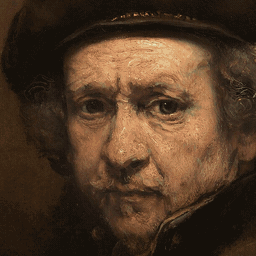
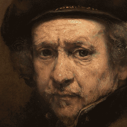
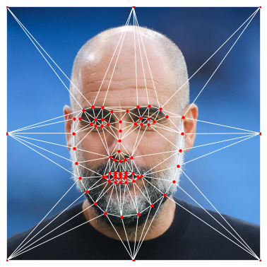
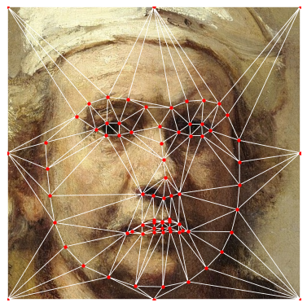

# Face Morphing

Two ways of morphing one face into another, implemented from scratch in NumPy —
a mesh-based approach using Delaunay triangulation and per-triangle affine
warps, and a meshless approach that warps by distance-weighted landmark
displacement.

No OpenCV morphing helpers are used: the affine solve, the point-in-triangle
test, the bilinear resampling and the blending are all written out directly.
OpenCV is used only for image I/O and colour conversion (`imread`, `imwrite`,
`cvtColor`, `resize`).

The two faces are Rembrandt self-portraits roughly two decades apart — the
morph is an ageing sequence rather than an arbitrary pair. Both are public
domain, via Wikimedia Commons:
[*Self-Portrait*, c. 1659](https://commons.wikimedia.org/wiki/File:Rembrandt_van_Rijn_-_Self-Portrait_-_Google_Art_Project.jpg)
and [*Self-Portrait with Two Circles*, c. 1665](https://commons.wikimedia.org/wiki/File:Rembrandt_Self-portrait_(Kenwood).jpg).
Each was rotated and scaled so the eyes land on the same axis at the same
separation before cropping to 512×512, which is what keeps the morph reading as
one face changing rather than two sliding past each other.

| Triangulation | Meshless |
|---|---|
|  |  |

## How it works

Both methods start from the same 68 facial landmarks, detected with dlib and
augmented with 8 points around the image border so the background gets warped
too rather than being left frozen at the edges.

The landmarks of the intermediate frame at blend factor `α` are just the
linear interpolation of the two landmark sets:

```
L(α) = (1 - α)·L_source + α·L_destination
```

Each method then answers the same question differently: *given an output pixel
on the intermediate mesh, where in the two original images did it come from?*
Both sample there with bilinear interpolation and cross-dissolve the two
colours by `α`.

### Part 1 — Delaunay triangulation

<p align="center">
  
  
</p>

A Delaunay triangulation is computed once and reused for every frame, so
triangle *k* of the intermediate mesh always corresponds to triangle *k* of
both originals. It is built on the *mean* of the two landmark sets rather than
on either face: a mesh that is Delaunay for the source is not Delaunay for the
destination, so triangulating the source alone makes quality asymmetric — best
at `α = 0` and degraded at `α = 1`. Both overlays above draw this shared mesh.

This pair triangulates into 142 triangles, and none of them fold: every
triangle keeps its orientation for the whole morph, and the smallest area any
of them reaches is about 4 px². That is a property of the pair, not a
guarantee. Two faces whose landmarks reverse their relative order — inner-mouth
points are the usual culprits — produce a triangle that flips sign partway
through and passes through zero area on the way. A degenerate triangle fed to
the affine solve returns entries of order 1e16 without raising, so triangles
below `MIN_TRIANGLE_AREA` are skipped instead.

An affine map has six unknowns, and three vertex correspondences give six
equations, so each triangle's transform is an exact linear solve:

```
⎡x₁ y₁ 1        ⎤ ⎡a⎤   ⎡x'₁⎤
⎢x₂ y₂ 1        ⎥ ⎢b⎥   ⎢x'₂⎥
⎢x₃ y₃ 1        ⎥ ⎢c⎥ = ⎢x'₃⎥
⎢        x₁ y₁ 1⎥ ⎢d⎥   ⎢y'₁⎥
⎢        x₂ y₂ 1⎥ ⎢e⎥   ⎢y'₂⎥
⎣        x₃ y₃ 1⎦ ⎣f⎦   ⎣y'₃⎦
```

Only each triangle's bounding box is scanned, with a barycentric test
rejecting pixels outside it — scanning the whole image per triangle would be
about 100× more work. The whole bounding box is tested, warped and sampled as
one array rather than pixel by pixel, which is worth another ~100×: a 512×512
frame takes ~0.16 s instead of ~17 s.

The warp is exact within a triangle but only *piecewise* affine, so the
derivative is discontinuous across triangle edges.

### Part 2 — Meshless morphing

No triangulation at all. Every landmark influences every pixel, with influence
falling off as an inverse power of distance:

```
κ(p, s) = 1 / (‖p - s‖^(2a) + ε)
```

and the displacement of a pixel is the κ-weighted mean of all the landmark
displacements:

```
V(p) = Σⱼ κ(p, sⱼ)·(tⱼ - sⱼ) / Σⱼ κ(p, sⱼ)
```

Because κ grows to its cap of `1/ε = 10⁶` as `p → sⱼ` (the `ε` keeps it
finite; at a landmark error of ~10⁻⁶ px the distinction never shows), a pixel
sitting on a landmark is displaced by
exactly that landmark's displacement, while pixels far from every landmark get
a smooth average. The result is smooth everywhere, with none of the creasing
the triangulated version can show along triangle edges — at the cost of the
warp being global, so no landmark's influence is ever strictly zero.

The falloff exponent `a` is tunable with `--falloff`; higher values make each
landmark's influence more local.

Every pixel's weights against every landmark are computed as one array, in
blocks of 16384 pixels so the full weight matrix is never materialised. The
cost is dominated by that weighted sum rather than by the sampling, so it
scales with pixels × landmarks: ~0.19 s per 256×256 frame and ~0.7 s at
512×512, against ~0.16 s for a 512×512 triangulated frame.

## Usage

```bash
pip install -r requirements.txt

python morph.py --method triangulation     # 512×512, ~0.16 s/frame
python morph.py --method meshless          # 256×256, ~0.19 s/frame
python morph.py --method meshless --size 512   # ~0.7 s/frame, ~36 s in total
```

Frames are written to `frames/<method>/` as lossless PNG (frame 0 is the
source image bit for bit) and the GIF and MP4 to `results/`.

At `α = 0` the morph reproduces the source image exactly, and at `α = 1` the
destination image exactly, for both methods.

The committed showcase GIFs are encoded at 256px:

```bash
python morph.py --method triangulation --gif-width 256
```

They are around 1.4 MB each, which is large for a README. Oil paint is the
worst case for GIF: the palette is only 96 colours, so the dithering pattern
differs everywhere between consecutive frames, and the inter-frame compression
GIF relies on has almost nothing to work with. The same sequence as H.264 is
about a quarter of the size at twice the resolution — but GitHub strips
`<video>` from a README and will not play a repository-relative MP4, so an
animated GIF is the only thing that moves on this page. The MP4s in `results/`
are the better artifact everywhere else.

To trade smoothness for bytes, drop the width and the palette rather than the
frame rate:

```bash
# 27 frames at 224px on a 64-colour palette: ~570 KB instead of ~1.4 MB
FILTER="fps=13,scale=224:-1:flags=lanczos,split[s0][s1];[s0]palettegen=max_colors=64:stats_mode=diff[p];[s1][p]paletteuse=dither=none"
ffmpeg -framerate 25 -i frames/triangulation/frame_%d.png -vf "$FILTER" results/triangulation.gif
```

```
--size N        working resolution
--frames N      number of frames in the morph (default 51)
--falloff A     meshless distance falloff exponent (default 2.0)
--fps N         playback rate of the video and the GIF (default 25). This sets
                the input and output rate together, so it changes how fast the
                morph plays, not how many frames it contains — use --frames for
                that. Lowering it will not shrink the GIF.
--gif-width N   GIF width in pixels (default: the working resolution)
--no-video      skip the MP4
--no-gif        skip the GIF
```

### Regenerating the landmarks

The landmark CSVs are committed, so this is only needed to swap in different
faces. The dlib model is ~100 MB and is not in the repo:

```bash
./download_predictor.sh
pip install dlib
python detect_landmarks.py --plot-dir results
```

Replace `data/source.jpg` and `data/destination.jpg` with your own 512×512
faces first. Detection takes the first face found in each image.

Leave the face some margin in the frame. dlib extrapolates jaw landmarks past
the silhouette, so a tight crop can put them outside the image, and `morph.py`
rejects landmark sets that fall outside the working resolution rather than
silently clamping them.

## Layout

```
morph.py              morph two faces and render the result
detect_landmarks.py   regenerate the landmark CSVs with dlib
morphing/
  landmarks.py        detection, CSV I/O, landmark interpolation
  triangulation.py    Delaunay + per-triangle affine warping
  meshless.py         distance-weighted displacement warping
  interpolation.py    bilinear sampling shared by both methods
  rendering.py        frames → PNG sequence, MP4, GIF
data/                 the two faces and their landmark CSVs
results/              committed GIFs and triangulation plots
```
